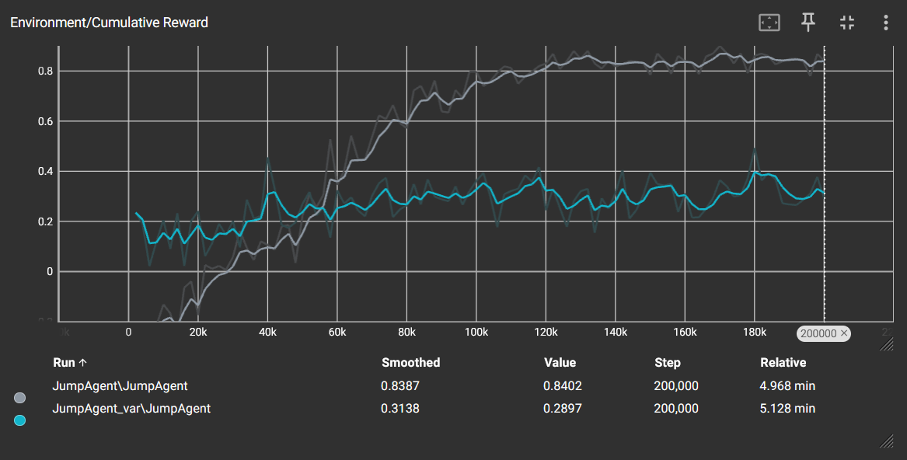

# VRXP-labo-06-Jumper
## Intro
De opdracht was om een zelflerende agent te maken die obstakels kan ontwijken door er over te springen. Als extra functionaliteit is er gekozen voor het kruispunt, waarbij de agent obstakels van twee verschillende richtingen moet ontwijken.

*Voor deze opdracht zijn twee verschillende scripts gebruikt om de impact van beloningen te testen. Hierover wordt later meer verteld.*

## Opzet
Maak eerst 3 lege scripts aan: GravityController, JumpAgent en ObstacleChecker. Wat deze scripts precies doen komt later.

Om de scene te maken moeten een aantal object worden toegevoegd. Buiten de standaard aanwezige objecten moeten er eerst twee lege objecten aangemaakt worden. 

Het eerste is GlobalGravity. Hierop wordt later een script geplaatst die de globale zwaartekracht van de scene bepaalt. 

Het andere object is de JumpTest. Hierin gebeurt alles dat met het eigenlijke testen te maken heeft. De nodige objecten zijn: twee planes in kruisvorm, een cube (de agent), twee lege objecten aan bijde uiteinden van de planes (Finish) en tot slot een lange balk (het obstakel).

Geef de Agent eerst het JumpAgent script (Als je dit niet doet zal er automatisch een standaard script worden gegenereerd bij de volgende stappen. Dit kan voor verwarring en problemen zorgen en zal dan eerst moeten worden verwijderd). Voeg dan de 'Decision Requester' en 'Behavior Parameters' componenten toe.

Geef vervolgens de agent twee 'Ray Perception Sensor 3D' componenten. Deze geven de mogelijkheid aan de agent om de obstakels te zien. Het is aangeraden om eerst twee lege objecten te maken waarin je deze componenten steekt, dit laat toe de rays te draaien naar de richting naar keuze. Zorg dat de richting van elk ray object gelijk wordt gesteld met één van de planes.  Eén enkele straal per ray object is voldoende.

De twee finish object moeten allebei een hitbox krijgen die als trigger dient. Zo kan er gechecked worden waneer een obstakel voorbij de speler is geraakt en de episode succesvol kan worden beëindigd. 

Het obstakel object kan best ergens geplaatst worden waar het niet in de weg staat (Onder de planes is aangeraden).

## Scripts
Er zijn drie scripts voor dit project. GravityController en ObstacleChecker zijn vrij simpel.

GravityController past de globale zwaartekracht aan. (Bij deze opdracht was deze op x2 gezet, maar dit kaan eigen behoren worden aangepast)

    public class GravityController : MonoBehaviour
    {
        public float gravityMod = 2;
    
        void Start()
        {
            Application.runInBackground = true;
            Physics.gravity *= gravityMod;
        }
    }
ObstacleChecker kijkt enkel of dat deze botst met de Finish trigger en roept dan de EndRached methode aan in het hoofdscript (JumpAgent).

    public class ObstacleChecker : MonoBehaviour
    {
        public GameObject agent;
    
        private void OnTriggerEnter(Collider other)
        {
            if (other.gameObject.layer == 7)
                agent.GetComponent<JumpAgent>().EndReached();
        }
    }
De JumpAgent is wat complexer.

    public class JumpAgent : Agent
    {
        public Rigidbody rigidB;
        public float jumpForce;
        public bool isGrounded = true;
    
        public GameObject obstacle;
        private Vector3 obstacleMoveDirection;
    
        private bool badEnd;
        private bool goodEnd;
    
        public override void OnEpisodeBegin()
        {
            // reset de positie en orientatie als de agent gevallen is
            if (this.transform.localPosition.y < 0 || badEnd)
            {
                badEnd = false;
                this.transform.localPosition = new Vector3(0, 0.5f, 0);
                this.transform.localRotation = Quaternion.identity;
            }
    
            // Bepaal richting van obstakel
            int obstacleDirection = Random.Range(0, 2);
            // Plaatsen van een obstakel + snelheid
            if (obstacleDirection == 0)
            {
                obstacle.transform.localPosition = new Vector3(-20f, 0.5f, 0);
                obstacle.transform.eulerAngles = new Vector3(0, 0, 0);
                obstacleMoveDirection = new Vector3(Random.Range(10,20) * Time.deltaTime, 0, 0);
            }
            else
            {
                obstacle.transform.localPosition = new Vector3(0, 0.5f, -20f);
                obstacle.transform.eulerAngles = new Vector3(0, -90, 0);
                obstacleMoveDirection = new Vector3(Random.Range(10, 20) * Time.deltaTime, 0, 0);
    
            }
        }
    
        public override void CollectObservations(VectorSensor sensor)
        {
            // Target en Agent posities
            sensor.AddObservation(isGrounded);
            sensor.AddObservation(this.transform.localPosition);
        }
    
        public override void OnActionReceived(ActionBuffers actionBuffers)
        {
            obstacle.transform.Translate(obstacleMoveDirection);
            int jump = actionBuffers.DiscreteActions[0];
            // Acties, size = 1
            if (jump == 1 && isGrounded)
            {
                rigidB.AddForce(Vector3.up * jumpForce, ForceMode.Impulse);
                isGrounded = false;         
            }
    
            // Beloningen
            if (badEnd)
            {
                AddReward(-1f);
                EndEpisode();
            }
            else if (goodEnd)
            {
                goodEnd = false;
                AddReward(1.5f);
                EndEpisode();
            }
            else if (actionBuffers.DiscreteActions[0] == 1)
                AddReward(-.5f);
            
        }
    
        public override void Heuristic(in ActionBuffers actionsOut)
        {
            var discreteActionsOut = actionsOut.DiscreteActions;
            discreteActionsOut[0] = Input.GetKey(KeyCode.Space) ? 1 : 0;
           
        }
    
        private void OnCollisionEnter(Collision collision)
        {
            if (collision.gameObject.layer == 6)
                badEnd = true;
            if (collision.gameObject.layer == 3)
                isGrounded = true;
        }
    
        public void EndReached()
        {
            goodEnd = true;
        }
    }
Een variatie op dit script heeft een lichtjes ander beloningsuitdeling.

	    // Beloningen
		if (badEnd)
		{
		AddReward(-1f);
		EndEpisode();
		}
		else if (goodEnd)
		{
		goodEnd = false;
		AddReward(1.5f);
		EndEpisode();
		}
		else if (actionBuffers.DiscreteActions[0] == 1 && isGrounded)
		AddReward(-.5f);
Bij deze alternatieve code wordt de agent enkel afgestraft als hij weldegelijk springt. In tegenstelling tot het vorige script, waar de afstraffing gebeurt telkens die een spring input geeft.

Uit testen is wel duidelijk dat het eerste script aanzienlijk betere resultaten levert. Maar met meer tijd en aanpassingen zou dit verschil mogelijks kleiner kunnen gemaakt worden.

De grijze lijn toont de eerste versie, de blauwe de tweede.

